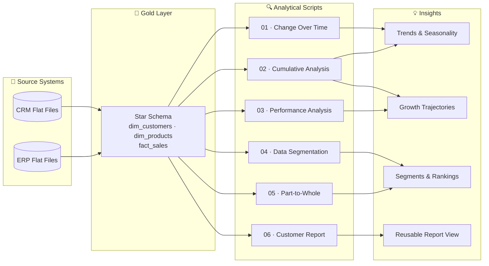

# 📊 Advanced SQL Analytics — Sales Intelligence Project


-gold)


A production-grade analytics project using advanced SQL — CTEs and Window Functions — to transform raw sales data into strategic business insights across time trends, customer segments, product performance, and revenue contribution.
 
---

## 📑 Table of Contents

- [Overview](#-overview)
- [Repository Structure](#-repository-structure)
- [Data Architecture](#%EF%B8%8F-data-architecture)
- [Project Components](#-project-components)
- [Analysis Breakdown](#-analysis-breakdown)
- [Technical Skills Demonstrated](#%EF%B8%8F-technical-skills-demonstrated)
- [Tech Stack](#%EF%B8%8F-tech-stack)
- [Key Business Questions Answered](#-key-business-questions-answered)
- [License](#-license)

---

## 📖 Overview

This repository contains a structured **Advanced Analytics** project performed entirely in T-SQL on a star-schema sales database. It queries the **Gold layer** of a medallion architecture — clean, business-ready data composed of one fact table and two dimension tables — to answer strategic business questions across sales trends, customer behavior, product performance, and revenue distribution.
 
The project is organized into **six analytical modules**, each targeting a distinct analytical pattern used in real-world business intelligence workflows.
 
---

## 📂 Repository Structure

```
📦 advanced-sql-analytics/
│
├── 📄 1_change_over_time_analysis.sql      # Time-series trend tracking
├── 📄 2_cumulative_analysis.sql            # Running totals & moving averages
├── 📄 3_performance_analysis.sql           # YoY product benchmarking
├── 📄 4_data_segmentation.sql              # Customer & product tier grouping
├── 📄 5_part_to_whole_analysis.sql         # Category revenue share analysis
├── 📄 6_report_customers.sql               # Consolidated customer KPI view
│
├── 📁 datasets/
│   ├── dim_customers.csv                   # Customer dimension (18,500 records)
│   ├── dim_products.csv                    # Product dimension (295 records)
│   └── fact_sales.csv                      # Sales fact table (60,400 records)
│
└── 📄 README.md
```

---

## 🏗️ Data Architecture

The analysis operates on the **Gold layer** of a Medallion architecture — the business-ready, integrated output of an upstream ETL pipeline:



| Table | Rows | Description |
|---|---|---|
| `gold.fact_sales` | ~60,400 | Order-level transactions — bike and equipment sales with amount, quantity, and price per line |
| `gold.dim_customers` | ~18,500 | Customer profiles across multiple countries, including gender, birthdate, and account creation date |
| `gold.dim_products` | ~295 | Full product catalog spanning bikes, components, clothing, and accessories — with category, subcategory, cost, and product line |

---

## 🧱 Project Components

| # | Component | Description |
|---|---|---|
| 01 | **Change Over Time Analysis** | Month-by-month and year-by-year sales trend tracking |
| 02 | **Cumulative Analysis** | Running totals and moving averages for long-term growth visibility |
| 03 | **Performance Analysis** | Year-over-year product benchmarking against historical averages |
| 04 | **Data Segmentation** | Customer and product grouping into meaningful business tiers |
| 05 | **Part-to-Whole Analysis** | Category-level revenue contribution as a share of total sales |
| 06 | **Customer Report View** | A consolidated SQL View delivering full customer KPI profiles |

---

## 🔍 Analysis Breakdown

### 1. Change Over Time Analysis (`1_change_over_time_analysis.sql`)

Tracks how key sales metrics evolve across time using three different date-formatting approaches — enabling flexible time-series slicing for dashboards or reports.

**Questions answered:**
- How do total sales, unique customer count, and order quantity change month over month?
- What seasonal patterns or growth periods exist in the data?

**Approaches used:**

| Method | Function | Output |
|---|---|---|
| Year + Month parts | `YEAR()`, `MONTH()` | Numeric year/month columns |
| Truncated date | `DATETRUNC(month, ...)` | Clean date column for charting |
| Formatted string | `FORMAT(date, 'yyyy-MMM')` | Human-readable labels |

**SQL techniques:** `DATEPART()`, `DATETRUNC()`, `FORMAT()`, `SUM()`, `COUNT(DISTINCT)`, `GROUP BY`

---

### 2. Cumulative Analysis (`2_cumulative_analysis.sql`)

Builds a running picture of business growth by calculating cumulative revenue and a moving average price — revealing whether the business is accelerating, plateauing, or declining over the years.

**Questions answered:**
- What is the cumulative revenue trajectory across all years?
- How has the average selling price shifted year over year?

**Output columns:**

| Column | Description |
|---|---|
| `total_sales` | Sales for that year |
| `running_total_sales` | Cumulative sales from year one to current |
| `avg_price` | Average price for that year |
| `moving_average_price` | Expanding average price up to current year |

**SQL techniques:** `SUM() OVER(ORDER BY)`, `AVG() OVER(ORDER BY)`, `DATETRUNC()`, CTEs

---

### 3. Performance Analysis (`3_performance_analysis.sql`)

Benchmarks each product's annual sales against two reference points — its own all-time average and its prior year's result — to label every data point as improving, declining, or stable.

**Questions answered:**
- Which products are consistently above or below their historical sales average?
- Did a product grow or shrink compared to last year?

**Output labels:**

| Dimension | Labels |
|---|---|
| vs. historical average | `Above Avg` / `Below Avg` / `Avg` |
| vs. previous year | `Increase` / `Decrease` / `No Change` |

**SQL techniques:** `LAG()`, `AVG() OVER(PARTITION BY)`, `CASE`, `LEFT JOIN`, multi-layer CTEs

---

### 4. Data Segmentation (`4_data_segmentation.sql`)

Groups both products and customers into actionable business tiers using spending behavior and customer tenure — enabling targeted marketing, retention, and pricing strategies.

**Part A — Product Cost Segmentation:**

| Segment | Cost Range |
|---|---|
| Below 100 | cost < 100 |
| 100–500 | cost BETWEEN 100 AND 500 |
| 500–1000 | cost BETWEEN 500 AND 1000 |
| Above 1000 | cost > 1000 |

**Part B — Customer Segmentation:**

| Segment | Logic |
|---|---|
| **VIP** | Lifespan ≥ 12 months AND total spending > €5,000 |
| **Regular** | Lifespan ≥ 12 months AND total spending ≤ €5,000 |
| **New** | Lifespan < 12 months |

**SQL techniques:** `CASE`, `DATEDIFF()`, `SUM()`, `MIN()`, `MAX()`, subqueries, CTEs, `GROUP BY`

---

### 5. Part-to-Whole Analysis (`5_part_to_whole_analysis.sql`)

Calculates each product category's percentage share of total company revenue — identifying which categories are the true revenue drivers vs. minor contributors.

**Questions answered:**
- Which product categories generate the most revenue?
- What percentage of total sales does each category represent?

**Output columns:**

| Column | Description |
|---|---|
| `total_sales` | Revenue for that category |
| `overall_sales` | Grand total revenue across all categories |
| `percentage_of_total` | Category share as a rounded percentage |

**SQL techniques:** `SUM() OVER()` (unbounded grand total), `CAST()`, `ROUND()`, `LEFT JOIN`, CTEs

---

### 6. Customer Report View (`6_report_customers.sql`)

A production-grade SQL **View** (`gold.report_customers`) that consolidates customer demographics, transaction history, segmentation, and KPIs into a single reusable object — serving as the foundation for dashboards or downstream reporting tools.

**Report highlights:**

| Category | Fields Delivered |
|---|---|
| **Identity** | `customer_key`, `customer_number`, `customer_name` |
| **Demographics** | `age`, `age_group` (Under 20 / 20–29 / 30–39 / 40–49 / 50+) |
| **Segment** | `customer_segment` (VIP / Regular / New) |
| **Activity** | `total_orders`, `total_sales`, `total_quantity`, `total_products`, `lifespan` |
| **KPIs** | `recency` (months since last order), `avg_order_value`, `avg_monthly_spend` |

**View architecture:**

```
base_query              → joins fact_sales + dim_customers, computes age
  └─ customer_aggregation  → groups and aggregates at customer level
        └─ final SELECT     → applies segmentation logic + KPI calculations
```

**SQL techniques:** `CREATE VIEW`, `IF OBJECT_ID ... DROP VIEW`, multi-CTE architecture, `CONCAT()`, `DATEDIFF()`, `GETDATE()`, `CASE` for age groups and segments, `COUNT(DISTINCT)`

---

## 🛠️ Technical Skills Demonstrated

| Skill | Used In |
|---|---|
| Date functions: `DATETRUNC`, `FORMAT`, `DATEPART`, `YEAR`, `MONTH` | Module 1 |
| Running totals with `SUM() OVER(ORDER BY)` | Module 2 |
| Moving averages with `AVG() OVER(ORDER BY)` | Module 2 |
| Year-over-year comparison with `LAG()` | Module 3 |
| Partitioned window functions `OVER(PARTITION BY)` | Modules 2, 3 |
| Custom `CASE` segmentation logic | Modules 3, 4, 6 |
| CTEs — single, chained, and multi-layer | Modules 2–6 |
| Part-to-whole percentage with `SUM() OVER()` | Module 5 |
| Creating and managing SQL Views (`CREATE VIEW`) | Module 6 |
| Multi-table `LEFT JOIN` across fact and dimension tables | Modules 3, 4, 5, 6 |
| Subqueries for intermediate segmentation | Module 4 |

---

## 🛠️ Tech Stack

- **Database:** Microsoft SQL Server (Express edition is sufficient)
- **Language:** T-SQL — window functions, CTEs, joins, aggregate functions, date functions
- **Tooling:** SQL Server Management Studio (SSMS)
- **Diagrams:** Mermaid (renders natively in this README)
- **Version control:** Git / GitHub

---

## 💡 Key Business Questions Answered

- Which months or seasons drive the highest bike and equipment sales — and is there a clear seasonal pattern?
- Is the retailer's cumulative revenue growing year over year, or showing signs of slowdown?
- Which individual products (e.g. specific bike models or components) are outperforming their own historical average — and which are declining?
- Did a product category like Road Bikes or Accessories grow or shrink compared to the previous year?
- What share of total revenue comes from Bikes vs. Components vs. Clothing vs. Accessories?
- How many customers qualify as VIP (high spend + long tenure) vs. Regular vs. newly acquired?
- Which customers haven't placed an order in a long time — potential churn risk?
- Who are the highest-value customers by total lifetime spend?
- What is the average order value and average monthly spend per customer across the base?

---

## 📜 License

This project is licensed under the [MIT License](LICENSE) — feel free to use, modify, and share with attribution.
